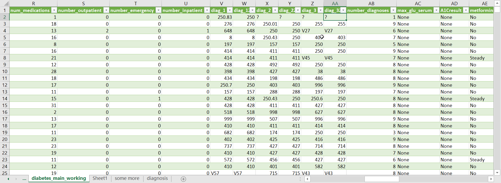
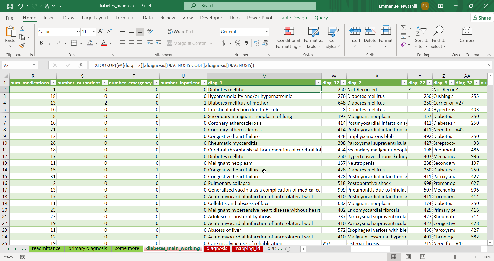
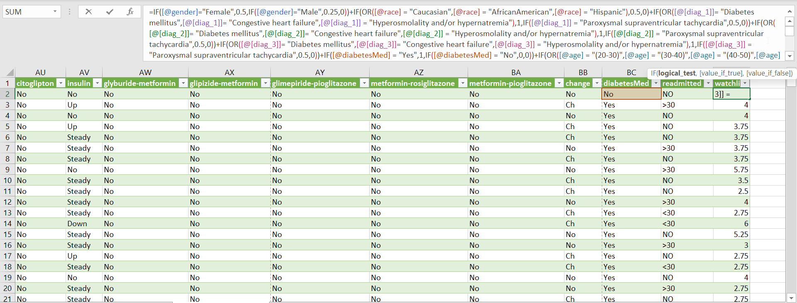
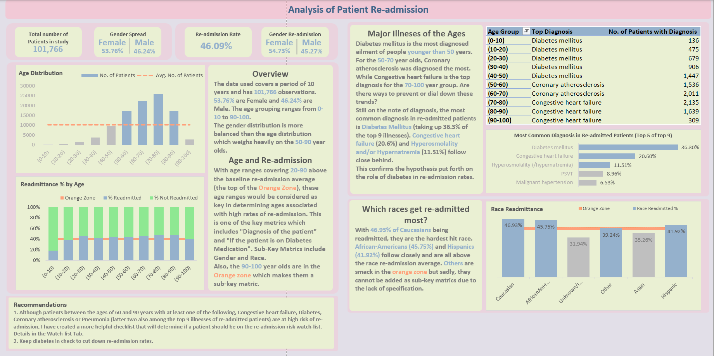
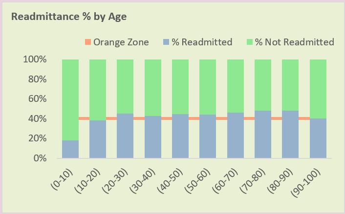
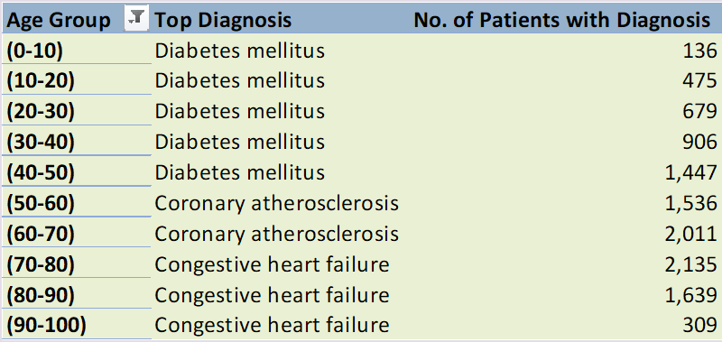
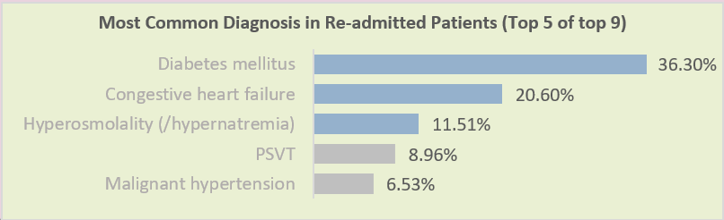
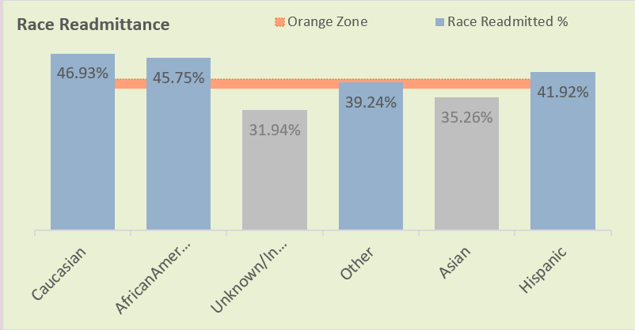
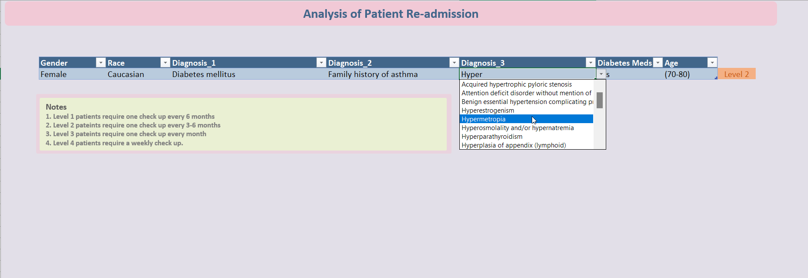

# Re-admission In Healthcare Analysis

## Introduction

An Excel project that looks into re-admission of patients in the health sector. The data set was sourced from [UCI Machine Learning Repository](https://archive.ics.uci.edu/ml/datasets/Diabetes+130-US+hospitals+for+years+1999-2008#). It contains data spanning 10 years with patients' hospitalisation information from about 130 hospitals.

## Problem Statement

Under the strain of repeated patient readmission, personnel in the health sector reached out in a bid to figure out how to curtail this issue.
Here are some things they wanted us to look into:
1. What is the most common primary diagnosis by age group?
2. What is the effect of diabetes on readmission rate?
3. Which group of patients should hospitals focus their follow-up efforts to better monitor patients with a high probability of readmission?

## Skills/Concepts Demonstrated

In the course of this project, I was able to incorporate the following Excel features:
- XLOOKUPs
- Find and Replace
- Transformation
## Transformations

Minor transformations were carried out on the main table to get in primed for analysis.
The transformation included converting the diagnosis from ICD-9 format to text readable format, normalisation of the age and weight columns, conversion of discharge_disposition_id and admission_source_id to from their ID formats to a readable text format using the provided mapping_id table and adding the watchlist_count column.

|  ||
|:---:|:---:|
|*Original State of data before transformation*|*Diagnosis tranformed to a more readable for using data from [www.cms.gov](https://www.cms.gov/Medicare/Coding/ICD9ProviderDiagnosticCodes/codes)*|

|  |
|:---:|
|*watchlist column added to the data to measure each patients' individual watchlist rating*|
## Visualisation

This report comprises of two pages:
1. Dashboard
2. Watchlist Check

## Analysis

### Main Dashboard

#### Overview
Over the course of 10 years, 101,766 hospitalisations from 130 hospitals were documented and the data (after de-identification) was analysed. With a readmission rate of **46.09%** there was definitely a reason for worry.
Initial analysis shows a relative balance across the genders but a left skewed distribution across the ages with a majority of documented patients being between **50 and 90 years** of age.

#### Balancing the Skew
Looking at the massive skew in the age distribution, there needed to be a balancing of the scales before further analysis could be carried out.
I chose to balance the ages by running an analysis based on the percentage of readmission of each age group per the age group as opposed to simply getting the readmission percentage of each age group with all groups in mind (simply put, results would be 20% of age group X was readmitted as opposed to 12% of readmitted patients belong to age group X). This approach assists in resolving skewed data, as utilizing the latter method would result in a readmission rate of **9.18%** for individuals aged 40-50 years. However, if the former method is employed, a more accurate and representative readmission rate of **43.96%** (of 40-50 year olds being readmitted) is obtained.

With that in mind, we can see that all age ranges between **20 and 90** are above the average (top of the orange zone) readmission rate for all ages which makes each of them a valid key metric. The **90-100** years olds are smack in the middle of the orange zone so this makes them a sub-key metric.

#### Brief explanation of Metrics
The Metrics are basically measures used to determine how much of a risk a patients has at readmission.
The following will help give you a better understanding of the term Metrics as used in this study.
- Key metrics are **Diagnosis of the patient**, **If the patient is on Diabetes medication or not** and the **Age of the patient**.
	- All key metrics above the metrics average yield a score of **1**.
	- All key metrics within the **orange zone** are regarded as sub-key metrics and yield a score of **0.5**.
	- All key metrics below the the **orange zone** yield a score of **0**.
- Sub-Key metrics are **Gender** of the patient and the **Race of the patient**.
	- All Sub-key metrics above the metrics average yield a score of **0.5**.
	- All Sub-key metrics within the **orange zone** are regarded as Sub-sub-key metrics and yield a score of **0.25**.
	- All Sub-key metrics below the the **orange zone** yield a score of **0**.

#### Age related Illnesses?

Looking at the ages and the major illnesses that they are diagnosed with, we can see that **Diabetes mellitus** ranks highest in groups between the ages of **0 and 50** years. **Coronary atherosclerosis** was the major diagnosis in two major groups (**50-60** and **60-70**) while **Congestive heart failure** was the most diagnosed primary ailment for people between the ages of **70 and 100**.

#### Most common Diagnosis in re-admitted Patients

We limited our study to the top 9 (and displayed only the top 5) most common diagnosis of re-admitted patients. Diabetes took up **36.3%** of the  "top rankers" to stand out as the most diagnosed ailment in re-admitted patients. This is a confirmation to the hypothesis put forth by some doctors that Diabetes played a major role in re-admission rates.

#### Does Race Really Matter?

Having the same issue as we had with the age distribution (skewing), we had to look at race re-admission rates per race basis.
With **46.93%** of **Caucasians** being re-admitted, this race stood at the most risk of readmission. For the sake of metrics though, **African-Americans** (**45.75%**) and **Hispanics** (**41.92%**) which are above the orange zone are also considered as sub-key metrics. **Others** would have been considered as a Sub-sub-key metrics but for its lack of specification as to which Race this belongs to.

### Watchlist

#### The rules
The watch-list severity count is calculated using the following:
- The key metrics to watch out for are:
	- Diagnosis
	- If patient is on Diabetes Medication or not
	- Age
- Sub key metrics to watch out for:
	- Gender
	- Race
- The requirements for the watch-list is as follows:
	- A patient must have a minimum score (sum total) of 3 to be included in the watch-list.
	- All Sub-key metrics:
		- Above the Orange Zone will yield a score of 0.5
		- Within the Orange Zone yields a score of 0.25
		- Below the Orange Zone yields a score of 0
	- All Key metrics:
		- Above the Orange Zone will yield a score of 1
		- Within the Orange Zone yields a score of 0.5
		- Below the Orange Zone yields a score of 0
	- For Diagnosis, each of the patient's diagnosis (primary, secondary and tertiary) will be regarded as a metric.
	- **60-90** year old who are diagnosed with **Congestive Heart failure**, **Diabetes Mellitus**, **Coronary atherosclerosis** or **Pneumonia** in any of their diagnosis will also have a score of 1 due to the fact that these combination topped the charts in re-admission.
- The scale for the Watch-list will be from 0 to 10
	- Less than 3 will be considered as Normal or Okay, requiring only the normal general check up.
	- 3-4.99 will be considered Level 1, requiring check up once in 6 months.
	- 5-6 will be considered Level 2, requiring check up every 3 to 6 months
	- 6.1-7 will be considered as Level 3, requiring check up every month
	- Greater than 7 will be considered Level 4, check up every week.

#### How it works
At the end of a session with a patient, a doctor can fill out the watch-list wiht information from patient's file and get immediate results which he can add as a recommendation under the patient's report.

## Conclusion and Recommendations

Having proved the theory about the role of diabetes in re-admission rates, it can be seen that to keep readmission rates in check, it would be best to tackle the diabetes problem squarely to keep down rehospitalisation.
### Recommendation
1. The group to focus follow-up on would be the **60-90** year olds with at least one of the following diagnosis, Congestive heart failure, Diabetes, Coronary atherosclerosis and Pneumonia, are at high risk of readmission.
2. Keeping the diabetes cases at a low will improve the re-admission rates.
3. Use the watch-list to give you a more rounded selection of patients that are at risk.

You can reach me on [Twitter](https://twitter.com/emmanwashili) or [LinkedIn](https://www.linkedin.com/in/emmanuel-nwashili-7051097b)
